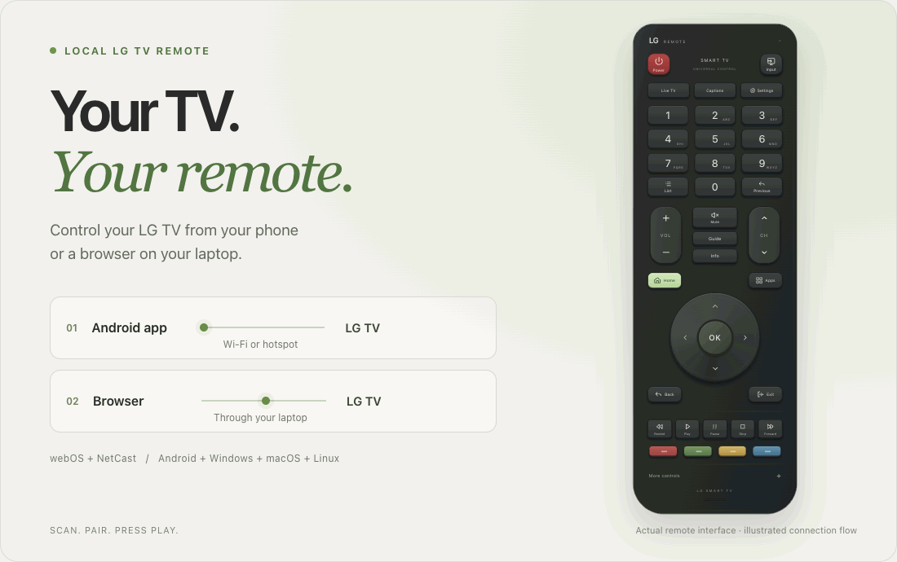

# Universal TV Remote

Lost the remote? Use your Android phone or a browser to control your TV.
Scan for your TV, pair it once, and use familiar buttons for volume, channels,
Home, apps and playback.

<p align="center">
  
</p>

<p align="center">
  <a href="https://github.com/arman0824/Universal-TV-Remote/releases/latest/download/Universal-TV-Remote-2.0.0.apk"><strong>Download Android app</strong></a>
  &nbsp; · &nbsp;
  <a href="#use-a-laptop">Laptop setup</a>
  &nbsp; · &nbsp;
  <a href="#how-it-works">How it works</a>
  &nbsp; · &nbsp;
  <a href="docs/assets/remote-preview.png">Still image</a>
</p>

## Choose how to use it

| Option | What you need |
|---|---|
| **Android app** | An Android 8.0+ phone and your TV. No laptop needed. |
| **Browser remote** | A Windows, Mac or Linux laptop running the server. Open the remote on that laptop or on a phone, including an iPhone. |

Works with the TV systems listed below. The app chooses a different connection and
pairing method for each system. Your TV needs to be powered on. Some buttons depend on the model;
the power button can turn the TV **off**, but cannot wake it up.

## Supported TV systems

| TV system | How to connect |
|---|---|
| **Android TV / Google TV** | Tap Connect, then enter the six letters/numbers shown on the TV. Requires Android TV Remote Service v2. |
| **Samsung Smart TV** | Choose **Allow** on the TV. Requires its WebSocket remote service; older models with other protocols are not supported. |
| **Roku TV / Roku player** | Enable **Settings → System → Advanced system settings → Control by mobile apps → Network access** on the TV. No pairing code is needed. |
| **webOS** | Approve the connection prompt on the TV. |
| **NetCast** | Enter the six-digit pairing code shown on the TV. |

These handlers are included in **both the Android app and the laptop server**.
Android / Google TV includes many models from Sony, TCL, Hisense, Philips and
other brands; check the TV's operating system, not just the name on the box.

**Universal is the project name, not a promise that every TV works.** Fire TV,
VIDAA, Apple TV, proprietary smart-TV systems and TVs without network remote
control are not supported yet. A Roku or Android TV box controls that box;
it does not automatically give full control of the attached display.

## Use the Android app

1. On your phone, [download Universal TV Remote 2.0.0](https://github.com/arman0824/Universal-TV-Remote/releases/latest/download/Universal-TV-Remote-2.0.0.apk).
2. Open the downloaded `.apk` file. It is the Android app installer. If Android asks, allow your browser or file manager to **install unknown apps**, then tap **Install**.
3. Connect the phone and TV to the same Wi-Fi. **A phone hotspot works too** — see below.
4. Open **Universal TV Remote → Connect TV → Scan network** and select your TV.
5. Follow the pairing steps for your TV system above. If a code appears, enter it in **TV pairing code** and tap **Pair TV**. Android / Google TV codes can include letters A–F.

Once the app says **Connected**, use it like your normal remote. Dimmed buttons are unavailable for that TV system. Pairing is saved
on your phone. Version 2 uses a new Android app identity, so it installs separately
from the previous app and needs pairing once. Future updates to this app keep its pairing.

Can't find the download? Open [Releases](https://github.com/arman0824/Universal-TV-Remote/releases),
expand **Assets**, and choose the `.apk` file, not the source-code ZIP.

### Using your phone's hotspot

Turn on **Mobile hotspot** on your phone, then connect the TV to that hotspot
from the TV's Wi-Fi settings. Open Universal TV Remote on the hotspot phone and scan.
You can also use a second Android phone connected to the same hotspot.

If scanning finds nothing, find the TV's **IP address** in its network settings.
Enter that address under **Manual IP**, choose **TV system** if automatic detection
does not work, then tap **Connect**. Some hotspots block
connections between devices; use the hotspot phone or turn off device isolation
if that setting is available.

The APK needs a local connection to the TV. To control a TV from a different
network over the internet, use [family sharing](#share-with-family-over-the-internet).

## Use a laptop

The server is a small program that runs on your laptop and passes button presses
from the browser to the TV. These steps work on **Windows, macOS and Linux**.

### 1. Get the project

Install the **LTS version of [Node.js](https://nodejs.org/en/download)** first.
Then [download this project as a ZIP](https://github.com/arman0824/Universal-TV-Remote/archive/refs/heads/main.zip)
and extract it. You can also use **Code → Download ZIP** at the top of this repo.

Connect the laptop and TV to the same Wi-Fi or local network. If using a phone
hotspot, connect the laptop and TV to that hotspot.

### 2. Start the server

Open a terminal in the extracted project folder — the folder containing
`package.json` — and run:

```sh
npm run start:phone
```

No `npm install` step is needed.

Prefer double-clicking? After installing Node.js, open **`phone.bat` on Windows**
or **`phone.command` on Mac** inside the project folder. On Mac, if it is blocked,
right-click the file and choose **Open**.

### 3. Open the remote

The terminal prints an address like this:

```text
Started Universal TV Remote at http://192.168.1.25:4173
```

Open **the address your terminal prints** in your browser. To use a phone's
browser, connect the phone to the same Wi-Fi or hotspot and open that address
there too. No phone app is needed for this option.

On the laptop itself, you can also open [localhost:4173](http://localhost:4173).

### 4. Pair your TV

Click **Connect TV → Scan network**, choose your TV, then approve the TV prompt
or enter its pairing code. If scanning finds nothing, enter the TV's
IP address under **Manual IP** and choose its **TV system**.

Keep the laptop on, awake and connected while using the browser remote.
If Windows asks about firewall access, allow Node.js on your **private network**.
On Mac, allow **Local Network** access if asked.

### 5. Stop when you're done

Run this from the project folder:

```sh
npm run stop
```

You can also double-click `stop.bat` on Windows or `stop.command` on Mac.
The launch command starts a background server; closing the browser does not stop it.

<details>
<summary>Other useful commands</summary>

| Command | What it does |
|---|---|
| `npm run status -- --host=0.0.0.0` | Checks the server and prints a local network address. |
| `npm start` | Runs for laptop-only use at `http://localhost:4173`. Stop with **Ctrl+C**. |
| `npm run start:phone -- --port=5000` | Uses port 5000 if the usual port is busy. |
| `npm run stop -- --port=5000` | Stops the server using that custom port. |

</details>

## Share with family over the internet

Optional: let family use the browser remote from another Wi-Fi network or mobile
data. The laptop stays near the TV and handles the connection.

<details>
<summary>Set up a family link</summary>

1. [Install ngrok](https://ngrok.com/download) on the laptop and create an ngrok account.
2. Start the laptop server and connect your TV as described above.
3. Open **Share remote → Permanent link setup**. Paste your ngrok [domain](https://dashboard.ngrok.com/domains) and [authtoken](https://dashboard.ngrok.com/get-started/your-authtoken).
4. Click **Save & start fixed link**, then **Copy link** and send it to your family.

Family members open the link in a browser. They do not need to install the app,
create an account or pair the TV again. Keep the laptop awake, its lid open, and
connected to both the TV's network and the internet.

**Anyone with the link can control the TV.** Share it only with people you trust.
Click **Stop sharing** to turn off the link. Ngrok may show a first-visit notice;
its account limits still apply. Local app and browser control need no ngrok account.

</details>

## How it works

Both versions use the same remote layout. The difference is which device talks
to the TV:

```text
Android app ─────────────── Wi-Fi / hotspot ──────────────► TV

Phone or laptop browser ──► Server on your laptop ────────► TV

Family browser ── Internet / ngrok ──► Laptop server ─────► TV
```

The Android app talks directly to the TV. A browser uses the laptop server to
find the TV, handle pairing and send commands. Family sharing adds an internet
link to that same laptop server.

### Where the code lives

| File or folder | Job |
|---|---|
| [`public/`](public/) | The remote's page, buttons and styling, shared by the browser and Android app. |
| [`server.js`](server.js) | Serves the browser app and routes discovery, pairing and commands. |
| [`tv-protocols/`](tv-protocols/) | Android / Google TV, Samsung and Roku clients, discovery and protocol helpers. |
| [`netcast.js`](netcast.js) | Handles older NetCast TVs and their six-digit pairing codes. |
| [`sharing.js`](sharing.js) | Starts and stops the optional family link through ngrok. |
| [`android/app/src/main/java/com/arman/tvremote/`](android/app/src/main/java/com/arman/tvremote/) | Android networking, TV discovery, pairing and commands. |
| [`android/web/`](android/web/) | Connects the shared interface to the Android code. |
| [`scripts/`](scripts/) | Starts/stops the server and builds the Android APK. |

<details>
<summary>A little more detail for developers</summary>

- **Discovery:** SSDP finds local TVs; mDNS discovers Android TV Remote Service. Android scans local interfaces, including the phone's hotspot, and selects a route that matches the TV's address.
- **Android / Google TV:** Certificate-based TLS pairing on port 6467 and Remote v2 control on 6466.
- **Samsung:** TV-approved WebSocket remote control on ports 8002/8001.
- **Roku:** ECP HTTP requests on port 8060; the TV must allow network control.
- **webOS:** WebSocket connections on ports 3001/3000 carry pairing and remote commands.
- **NetCast:** HTTP on port 8080 carries ROAP pairing and commands.
- **Browser API:** Button presses go to `/api/command`; the server forwards them to the paired TV.
- **Android:** A bundled WebView calls native Java through a bridge. Network work runs away from the UI thread.
- **Saved pairing:** The laptop keeps keys in `.tv-keys.json`. Android stores them encrypted using Android Keystore. Ngrok settings stay in `.sharing-config.json` on the laptop. These private files are excluded from Git.

Run the desktop tests with `npm test`. See the [Android guide](android/README.md)
for APK builds and Android tests. [Protocol notes](docs/PROTOCOLS.md) explain the
connection methods, limitations and reference sources.

</details>

## If something doesn't work

| Problem | Try this |
|---|---|
| **The TV doesn't appear** | Turn it on, check the Wi-Fi/hotspot connection, then try **Manual IP** using the address in the TV's network settings. |
| **The phone can't open the browser remote** | Use `npm run start:phone`, open the laptop's printed address, and check that both devices use the same network. Check firewall access and VPN settings too. |
| **`npm` isn't recognized** | Install Node.js, then close and reopen your terminal. |
| **Pairing fails** | Check the TV system. Approve the prompt, enter the shown code, or enable Roku network control. If needed, use **Settings → Forget saved TV key** and pair again. |
| **Buttons stop responding** | Check that the TV is on and reconnect. Its IP address may have changed after switching networks. |
| **The family link stops working** | Check that the laptop is awake, online and still connected to the TV. Restart sharing if needed. |

Automated tests cover protocol messages, simulated TV pairing, saved connections
and hotspot routing. Emulator tests use simulated TV services. Compatibility
with your exact TV model and hotspot still needs testing on real hardware.

Use local browser access on a trusted network: other devices on that network can
open the remote while the server is running.

---

MIT licensed. Independent project; not affiliated with any TV manufacturer.
